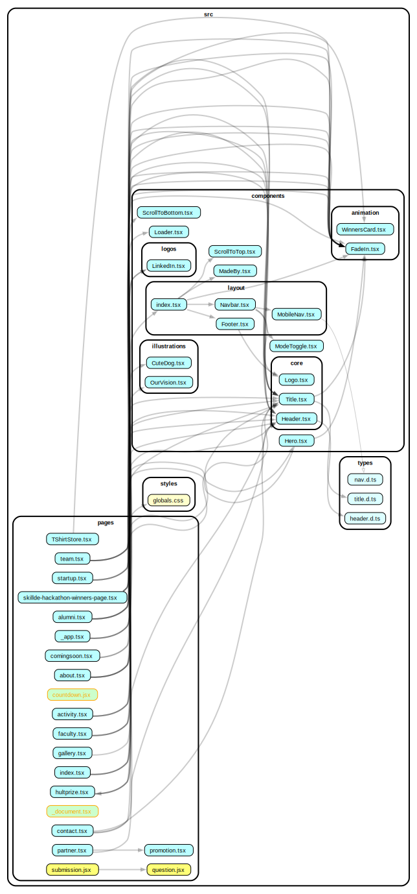

# IIC TMSL Website


> The repo for the official website of IIC TMSL.

## Features

- Merchandise section
- Hackathon section
- Light/Dark mode toggle
- Image Gallery
- Mobile Responsive Nav
- Lazy Loading Images

## Tech Stack

- [Next.JS](https://nextjs.org/) - The React Framework for the Web
- [Tailwind CSS](https://tailwindcss.com/) - Rapidly build modern websites without ever leaving your HTML.
- [Headless UI](https://headlessui.com/) - Unstyled, fully accessible UI components.
- [`framer-motion`](https://www.framer.com/motion/) - Production-ready declarative animations.
- [`lightbox.js-react`](https://www.getlightboxjs.com/) - The all-in-one React lightbox.

## 📂 Project Structure

Below is a visual representation of the project's file structure using a dependency graph:



## Development

1. To install the needed dependencies run

   ```bash
   npm install
   ```

2. To spin up dev server run

   ```bash
   npm run dev
   ```
   
3. To build this project run

   ```bash
   npm build
   ```

## Authors

- Ashhar Ali Ahmed - [@theashhar](https://www.github.com/theashhar)
- Kumar Aditya - [@Kumaraditya18027](https://www.github.com/Kumaraditya18027)
- Utsav Tiwari - [@utsav306](https://www.github.com/utsav306)


## License

[MIT](LICENSE)
